# Unity Architecture Template

## フォルダ構成

* [main project](./Assets/Scripts/Main/README.md)
* [test](./Assets/Scripts/Test/README.md)
* [unity extension](./Assets/Scripts/Custom/README.md)

## アーキテクチャのイメージ



## 各レイヤ間の呼び出し方

### アダプタ層からアプリケーション層の呼び出し

[サンプルコード](./Assets/Scripts/Test/Editor/UseCase/Player/RenamePlayerUseCaseSpec.cs)

```csharp
// use case を指定して必要な値を渡して呼び出す
var renamePlayerUseCase = new RenamePlayerUseCase(
    // repository のような how （どうやってするか）の部分はコンストラクタで注入する
    // DI できる環境であれば DI するほうがベスト
    playerRepositoryMock
    );

// use case にわたすためのプロトコルを用意する
var protocol = RenamePlayerProtocol.Create(1, "renamed name");

// Execute メソッド呼び出しで use case 実行
// UniTask 使える環境であれば UniTask に包んで返す
// 戻りの型は IApplicationResult
var result = renamePlayerUseCase.Execute(protocol);
```

* foreach を使用した値の取り出し

```csharp
// IApplicationResult は IEnumerable を実装しているため
// foreach を利用して値を取得することができる
// なお、失敗時には値を返さないため下記ループには入らない
// 失敗を無視して良いケースであれば使える取得方法
foreach (var renamedPlayer in result)
{
    // renamedPlayer: IPlayer をこのブロック内で使える
}
```

* LINQ を使用した値の取り出し

```csharp
// もちろん LINQ も使える
// こちらも失敗を無視して良いケースであれば使える取得方法
var renamedPlayer = result.FirstOrDefault();
```

* type switch を使用した値の取り出し

```csharp
// IApplicationResult は、成功時は UseCase.Success<T>, 失敗時は UseCase.Failure<T> という型になっているため
// 以下のようにパターンマッチを利用して値を取り出すこともできる
switch (result)
{
    case Success<IPlayer> success:
        // UseCase.Success<T>#Result: T で値取得可能
        var renamedPlayer = success.Result;
        // renamedPlayer: IPlayer をこのブロック内で使える
        return;

    case Failure<IPlayer> failure:
        // パターンマッチであれば失敗時パターンも記載可能
        // 失敗の内容は UseCase.Failure<T>#Errors: IEnumerable<ApplicationError> で値取得可能
        var errors = failure.Errors;
        // ...
        return;
}
```

### アプリケーション層からドメイン層の振る舞いの呼び出し

* [アダプタ層からアプリケーション層の呼び出し](#アダプタ層からアプリケーション層の呼び出し) と同じ、型が変わっただけ

| アプリケーション層        | ドメイン層          |
| ------------------------- | ------------------- |
| UseCase.ApplicationResult | Domain.DomainResult |
| UseCase.ApplicationError  | Domain.DomainError  |

